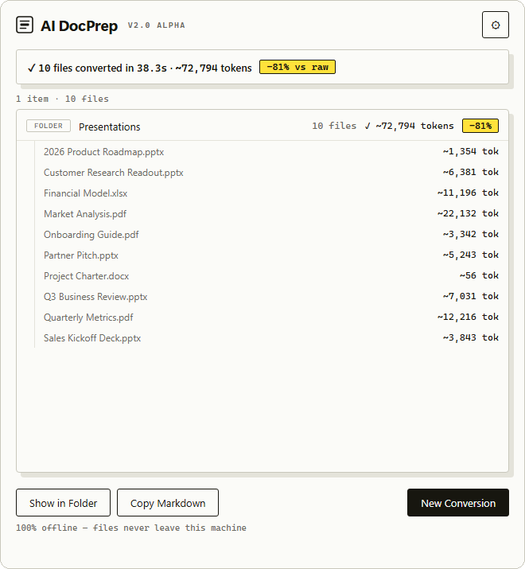

<p align="center">
  
</p>

<h1 align="center">AI DocPrep</h1>

<p align="center">
  Convert PDFs, Word docs, decks, and spreadsheets into clean, token-efficient Markdown, and redact the private parts. All of it happens on your computer. Nothing gets uploaded.
</p>

<p align="center">
  <a href="https://github.com/amitxm/AIDocPrep/releases"></a>
  
  <a href="LICENSE"></a>
</p>

<p align="center">
  <a href="https://aidocprep.app">aidocprep.app</a> ·
  <a href="https://github.com/amitxm/AIDocPrep/releases/tag/v2.0.1-beta.1">Download free beta</a> ·
  <a href="https://belsonbox.gumroad.com/l/aidocprep">Gumroad</a>
</p>

<p align="center">
  
</p>

## Why clean your documents first?

Office files are bloated with formatting metadata the model never needs. A `.docx` is a zip of XML several times the size of its actual text; a raw PDF upload is billed as extracted text *plus* a rendered image of every page. Converting to Markdown first means:

- **Fewer tokens.** You send only the words, so the same document costs a fraction of the context window.
- **Better answers.** Models follow semantic Markdown (headers, lists, tables) far more reliably than extraction noise.
- **One file.** Merge a folder of documents into a single `combined.md` with a generated table of contents.
- **Privacy.** Redact SSNs, credit cards, emails, phone numbers, names, and API keys on your machine, before anything reaches a cloud provider.

## What it does

- **Drag & drop queue.** Drop any mix of files and folders anywhere on the window; convert the whole batch with one click.
- **Token counts and savings.** Every file (and the batch total) shows an estimated token count and the percentage saved versus the raw source.
- **Flexible output.** Individual `.md` files, individual plus a combined master file, or the combined file only.
- **Redaction built in.** Three engines, all local: regex patterns, on-device NER, or a local LLM through Ollama.
- **Fully offline.** No account, no telemetry, no internet access during conversion. Works the same with Wi‑Fi off.
- **Safe defaults.** Conflicts keep both files, your existing notes are never overwritten, folder combining only touches files it just converted, and unsupported file types are rejected up front instead of guessed at.
- **OS integration.** Right-click "Convert to Markdown" in Windows Explorer; a setup script adds a macOS Finder Quick Action.

## Obsidian & PKM vaults

If you use Obsidian, Notion, or Logseq: converted notes carry YAML frontmatter (conversion date, source format, original filename) that Obsidian reads natively, combined files get a clickable table of contents, and clean structure improves the accuracy of vault search and AI plugins. Pre-existing `.md` notes in a folder are never swept into combined output.

## Command line

The engine runs headless via `docprep_core.py`, which is also the machine interface the desktop app drives:

```bash
# Convert files and folders (redacted, combined into one master file)
python docprep_core.py ./research report.docx --output combined-only --redact

# Machine-readable progress: one JSON event per line (start / file / combined / summary)
python docprep_core.py ./docs --json
```

Every option is a flag: output mode, conflict policy, YAML/TOC toggles, redaction engine and model, custom terms and prompt files. Exit codes: `0` ok, `1` partial failures, `2` no input, `130` cancelled. Run `--help` for the full list.

## How it's built

```
backend/          Python engine: markitdown conversion, redaction, combining, settings
docprep_core.py   Headless CLI wrapping the engine; emits JSON-lines events
app.py            Current shipping GUI (CustomTkinter)
desktop/          Next-generation app: Tauri 2 + Svelte 5, runs docprep-core as a sidecar
site/             aidocprep.app marketing page (static, served via Cloudflare)
tests/            Backend and GUI test suites
```

Conversion is [Microsoft's MarkItDown](https://github.com/microsoft/markitdown) with a purpose-built converter per format, run in parallel across ~75% of CPU cores. Office temp/lock files (`~$…`) are skipped.

**Token math, so you can audit the claims:** estimates use ~4 characters per token (within roughly ±15% for English). Savings baselines are honest per format — text formats compare against raw bytes; Word and Excel files against their uncompressed XML (there, the XML is the content); PDFs and PowerPoint decks against extracted text plus ~1,500 tokens per page or slide, matching what providers charge for raw uploads. Deck DrawingML is deliberately not used as a baseline — it's mostly geometry, and would overstate savings by orders of magnitude. Where no defensible baseline exists, no savings are shown.

**Redaction engines:** regex patterns always run first (emails, SSNs, credit cards, phone numbers, private keys, AWS/OpenAI/Slack tokens, credential assignments, connection-string passwords, IP/MAC addresses). Optionally add on-device NER (bundled spaCy `en_core_web_sm` — names, organizations, places) or a context-aware pass through your local Ollama server, chunked and serialized so the server isn't flooded.

## FAQ: Why use this instead of RAG?

Retrieval-Augmented Generation (RAG) is useful for searching across massive datasets (like millions of customer service logs), but it is often overkill and less effective for smaller knowledge bases (like code documentation, project folders, or product manuals).

### 1. Modern LLMs have massive context windows
Frontier models from Anthropic, OpenAI, and Google now ship context windows from 200k up to 1–2 million tokens — enough to fit hundreds of documents directly in the prompt. If your data fits in the context window, you don't need RAG.

### 2. RAG misses the "Big Picture"
RAG works by cutting documents into small chunks and retrieving only the most relevant-looking chunks. If a question requires synthesizing information spread across multiple pages, chapters, or files, RAG often fails to retrieve all the pieces. Giving the LLM the entire compiled file lets it reason across the whole dataset at once.

### 3. No retrieval failures or vector database setup
Vector search is imprecise and depends on the user using the right search terms. RAG also requires setting up database infrastructure, managing embedding models, and tuning chunk sizes. AI DocPrep has zero setup: just convert your documents, merge them into one file, and start chatting.

### 4. RAG is better with clean Markdown
If your dataset is so large that you *must* use RAG, chunking raw PDFs or HTML is notoriously messy. Running your documents through AI DocPrep first gives you clean Markdown tables, lists, and headers, which makes your embedding model and chunking strategy much more accurate.

### 5. Why not just use Claude Desktop, Cursor, or Codex directly on raw files?
While code editors and chat clients can index or parse local files, they have major limitations:
- **Format limits:** They often fail or hallucinate when parsing presentation slides (`.pptx`) or complex spreadsheets (`.xlsx`). AI DocPrep uses dedicated conversion engines (like `MarkItDown`) to translate tables and layouts into clean Markdown representations that LLMs actually understand.
- **Privacy:** Native chat apps upload your raw files straight to the cloud. AI DocPrep runs completely offline, meaning you can redact PII (SSNs, emails, credit cards, IP addresses) *before* the text leaves your machine.
- **Format-aware parsing:** AI DocPrep uses dedicated converters per format (via `MarkItDown`) instead of treating everything as plain text, so tables, slides, and spreadsheets survive the trip to Markdown.
- **Scattered files:** Uploading 50 files manually can trigger UI limits. AI DocPrep merges everything into a single structured master document with a generated Table of Contents, making context ingestion a one-click action.

## Privacy

There is no server behind AI DocPrep and no account to sign in to. Conversion makes no internet requests — the optional Ollama engine talks only to your own server on localhost. Turn off Wi‑Fi and verify. The code is public under the MIT license, so you or your security team can read exactly what it does instead of trusting this paragraph.

## Installation

The app is **free while it's in beta**. Grab it from the [releases page](https://github.com/amitxm/AIDocPrep/releases).

**macOS** — download the `.dmg` from the [latest beta](https://github.com/amitxm/AIDocPrep/releases/tag/v2.0.1-beta.1) and drag AI DocPrep into Applications. It's signed and notarized by Apple, so it opens normally — no security warnings, no Terminal workarounds. Apple Silicon only for now.

**Windows** — the native v2 build is still in progress; use the [v2 alpha installer](https://github.com/amitxm/AIDocPrep/releases/tag/v2.0.0-alpha.1) or the older [v1.2 release](https://github.com/amitxm/AIDocPrep/releases/tag/v1.2.0). Neither is code-signed yet, so SmartScreen will flag an unknown publisher — choose **More info → Run anyway**.

### Support the project

AI DocPrep is free to download and use — nothing to pay, no account. If it saves you tokens or time and you want to chip in, you can pay what you want on [Gumroad](https://belsonbox.gumroad.com/l/aidocprep). That funds the code-signing certificates and developer accounts behind the signed builds and the app store releases.

## Building from source

Prerequisites: Python 3.11+.

```bash
git clone https://github.com/amitxm/AIDocPrep.git
cd AIDocPrep

python -m venv .venv
source .venv/bin/activate  # Windows: .\.venv\Scripts\activate
pip install -r requirements.txt
python -m spacy download en_core_web_sm  # optional: the on-device NER redaction engine

# Run the app
python app.py

# Run the tests
python tests/test_backend.py
python tests/test_gui.py      # needs a display
```

Release builds: `.\build_win.ps1` then compile `installer.iss` with Inno Setup (Windows), or `bash build_mac.sh` (macOS). The Tauri app in `desktop/` has its own workflow: build the sidecar with `desktop/build-sidecar.ps1` (or `.sh`), then `npm run tauri dev`.

## License

MIT — see [LICENSE](LICENSE). Bundles [MarkItDown](https://github.com/microsoft/markitdown) (MIT, Microsoft).
